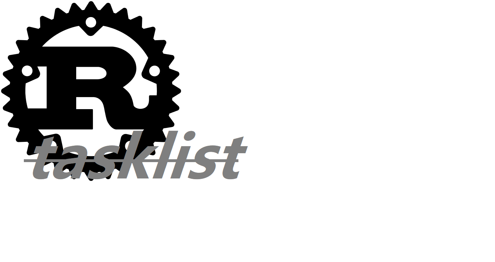
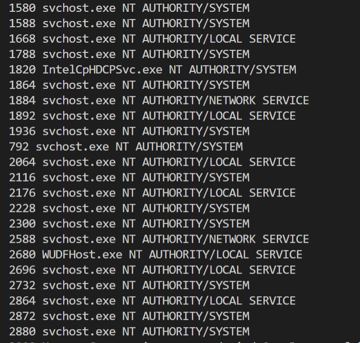
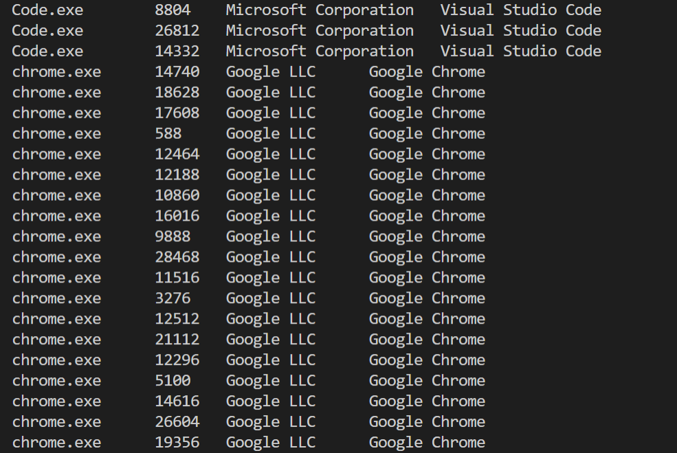

# tasklist

<p align="center">
    
</p>

_a small crate let you can easily get tasklist and process information on windows_

- based on [`windows-rs`](https://github.com/microsoft/windows-rs) crate 

#### what information you can get
1. Process name,pid,parrentID,threadsID.
2. Process start_time,exit_time,and CPU_time(including kernel time and user time).
3. Process path and commandline params.
4. Process SID and Domain/User.
5. Process IO infomation , including all of `IO_COUNTERS` member.
6. Process memory information , including all of `PROCESS_MEMORY_COUNTERS` member.
7. Process handles information , use `GetProcessHandleCount` Api.
8. Process file infomation , use `GetFileVersionInfoExW` Api.
9. Check whether the process is running in the WOW64 environment and get architecture info (x86/x64/ARM etc.)
10. Iterate over all processes.
11. Process termination functionality.

_remember some infomation need higher privilege in some specific windows versions_

## example
Get all process pid , process name and user .
```rust
use tasklist;

fn main(){
   
    let tl = tasklist::Tasklist::new().unwrap();
    tasklist::enable_debug_priv();
    for i in tl{
        println!("{} {} {}",i.get_pid(),i.get_pname(),i.get_user());
    }
}
```
<p align="center">
    
</p>

Get all process name , pid , company name , file description.

```rust
use tasklist;

fn main(){
    let tasks = tasklist::tasklist().unwrap();
    for i in tasks {
        match i.get_file_info(){
            Ok(info) => println!("{:?}", info.get("FileDescription")),
            Err(_) => (),
        }
    }
}
```
<p align="center">
    
</p>


## Usage
Add this to your `Cargo.toml`:

```toml
[dependencies]
tasklist = "0.3.0"
```